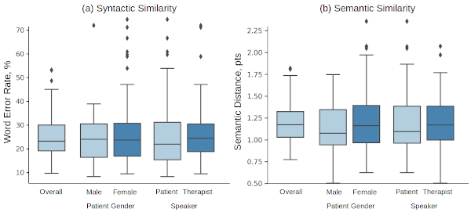
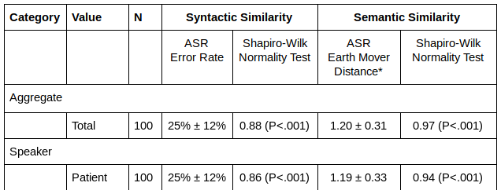
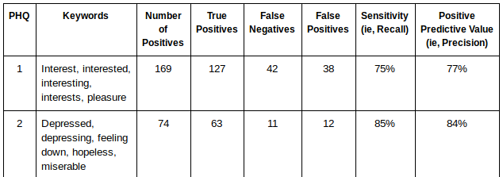
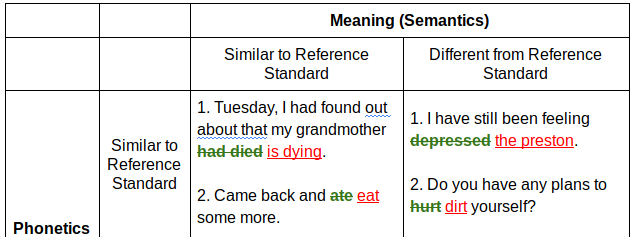

# Psychotherapy Analysis Project


## Table of Contents

[1. Introduction](#introduction)
[2. Data Preprocessing](#data-preprocessing)
[3. Speech-to-Text with Google Cloud](#speech-to-text-with-google-cloud)
[4. Evaluation](#evaluation)
[5. Reproducing Our Tables and Figures](#reproducing-otables-and-figures)

## 1   Introduction

Accurate transcription of audio recordings in psychotherapy would improve therapy effectiveness, clinician training, and safety monitoring. Although automatic speech recognition software (ASR) is commercially available, its accuracy in mental health settings has not been well described. It is unclear which metrics and thresholds are appropriate for different clinical use cases, which may range from population descriptions to individual safety monitoring. In this work, we develop a framework for evaluating success and failure modes of automatic speech recognition systems in psychotherapy.

## 2   Data Preprocessing

### 2.1   Prerequisites
 [FFmpeg](https://www.ffmpeg.org/) contains various audio/visual encoding and decoding formats. To install FFmpeg:

  1. (Recommended) Download a static binary and place in home dir: https://johnvansickle.com/ffmpeg/
  2. Compile from source: https://www.ffmpeg.org/

Your FFmpeg binary can be entirely in user-space (i.e., you do not need sudo).


### 2.2   Generating FLAC Files

In its raw form, our current audio files are in either WMA (windows media audio) or MP3 format. As [recommended by Google Cloud](https://cloud.google.com/speech-to-text/docs/best-practices), we convert our files to [FLAC](https://en.wikipedia.org/wiki/FLAC). In general, you should try to use FLAC for all your audio processing tasks. The MP3 format loses data during the compression process. While this is okay for human hearing (MP3 minimizes human perceptual data loss), it may lose important information for machine hearing tasks.

Below, we show the original (mp3/wma) specs of our data and the specs of our new FLAC files.  Most of these settings are [recommended](https://cloud.google.com/speech-to-text/docs/best-practices) by Google.
* Format: MP3/WMA -> FLAC
* Sample Rate: 44,100 Hz -> 16,000 Hz
* Channels: 2 (stereo) -> 1 (mono)

First, open [preprocessing/01_generate_flac.py](preprocessing/01_generate_flac.py) and edit the global variables: `INPUT_DIR`, `OUTPUT_DIR`, and `ffmpeg`. Then, run:

```bash
python preprocessing/01_generate_flac.py
```

If running on NERO or other compute cluster, submit your job with Slurm (see [preprocessing/01_slurm.sh](preprocessing/01_slurm.sh)).:

```bash
sbatch scripts/01_slurm.sh
squeue
```

The output flac files will be placed in `OUTPUT_DIR`.

### 2.3   Reference Standard JSON

The human-generated reference standard files (i.e., ground truth) are currently in TXT format, as delivered by the annotators. We need to convert these to JSON as a standardization step.

1. Ensure that `gt_dir` is correct inside `preproc/config.py`.
2. Run the following inside `preproc/`.

```bash
python 03_create_gt_json.py OUTPUT_DIR
```

where `OUTPUT_DIR` is the target location to place the new, ground truth JSON files.

## 3   Speech-to-Text with Google Cloud

### 3.1   Prerequisites
First, enter your GCloud key and bucket information in [gcloud/config.py](gcloud/config.py).

- **Google Cloud API Key**. This should be a *service account*. The key should have permissions to Google Cloud storage and Google Speech-to-Text API. Easiest but not-security-recommended solution would grant the service account with *Project Owner* status/permissions.
- **Bucket Name**. This bucket should already exist. Our script will not create a bucket. The files will be uploaded to this bucket.

Second, install the python dependencies.
```bash
pip install -r requirements.txt
```

### 3.2   Upload to Google Cloud

Once the audio files have been cleaned and standardized, we now upload the files to Google Cloud. We have two options:
1. We send the audio file to Google for each transcription request. Nothing will reside long-term on GCloud.
2. Before transcription, we upload all audio files to GCloud as a one-time operation. These files may sit there for a while. The transcription script will point to these files.

Option 2 is better than Option 1. Specifically, when we wish to tweak our transcription algorithm or model. With option 2, we do not need to continually re-upload (temporarily) each audio file.

To upload the files, see [gcloud/01_upload.py](gcloud/01_upload.py). Run it with the following command:
```bash
python gcloud/01_upload.py DATA_DIR
```

where `DATA_DIR` is the folder containing audio files. While running, the script will print the total upload progress.

### 3.3   Speech-to-Text

Now that we have a single bucket containing only flac files, we can run transcription and diarization.

```bash
python gcloud/02_transcribe.py OUTPUT_DIR
```

where `OUTPUT_DIR` is your desired *local* folder where to store the json transcription results. This script will also print the transcription progress.

## 4   Evaluation

Before we begin evaluation, we first combine Google Cloud ASR outputs with the human generated reference standard. The goal is to have a single JSON file which contains both the ASR output and reference transcriptions. This will make it very easy to compute metrics.

Overall, the data folder should look like the following (including the FLAC audio files). Each hash (399c9e2...) denotes a different therapy session.
```
data/
├── flac/
│   ├── 399c9e27729c267ea14974421038444c1c90325212b99b2fead3f6990395358.flac
│   ├── 6a6cba4540baeff375e0838e4080ab6c617835afea91dda6e29a4a67dbdcb1a.flac
│   ├── ...
├── gt/
│   ├── 399c9e27729c267ea14974421038444c1c90325212b99b2fead3f6990395358.json
│   └── 6a6cba4540baeff375e0838e4080ab6c617835afea91dda6e29a4a67dbdcb1a.json
│   ├── ...
├── machine
    ├── 399c9e27729c267ea14974421038444c1c90325212b99b2fead3f6990395358.json
    └── 6a6cba4540baeff375e0838e4080ab6c617835afea91dda6e29a4a67dbdcb1a.json
    ├── ...
```

4.1  Paired JSON File

To create the single JSON file, which we will called `paired.json` (because it creates a pair, consisting of a reference standard sentence and an ASR sentence), run:

```bash
python evaluation/01_create_paired_json.py data/machine data/gt
```

The paired json will be generated and will then create entries like:

```
 '556': {
	 'hash': 'dd01803e57a3b95fcfab584bfb09aa604d80c0452ce5cd90f02669b0f9b9b5e',
	 'ts': 102,
	 'speaker': 'P',
	 'gt': 'hello there how are you doing',
	 'pred': 'hello their how arent you doing'
}
```
Notice how we have the ground truth reference standard, ASR prediction, speaker (patient or therapist), hash, and timestamp, all in a single python dictionary!

### 4.2   Compute Metrics

We compute semantic and syntactic similarity metrics. This equates to Earth Mover's Distance (EMD) and word error rate (WER), respectively. Extracting embeddings is time consuming. Therefore, we first extract embeddings, save them to disk, then compute similarity metrics on these saved embeddings.

Download the published Word2Vec model: [[Google Drive](https://drive.google.com/file/d/0B7XkCwpI5KDYNlNUTTlSS21pQmM/edit)] [[website](https://code.google.com/archive/p/word2vec/)] (1.5 GB)

Once downloaded, uncompress the file: `gunzip GoogleNews-vectors-negative300.bin.gz` Take note of the location of the .bin file and update the `WORD2VEC_MODEL_FQN` variable inside `evaluation/config.py`.

Then, we compute semantic distance and WER over all therapy sessions:

```bash
python evaluation/02_compute_metrics.py
```

The above command takes between 10 and 30 minutes to complete. It is multi-threaded by default. The bottleneck is computing word emebddings since this requires loading a very large English vocabulary. The resulting file will be a CSV file, similar to below:

| hash                | speaker | WER  | BLEU | COSINE | EMD  | 
|---------------------|---------|------|------|--------|------| 
| 9c267ea1cb2fead3f95 | T       | 0.38 | 0.85 | 0.28   | 1.57 | 
| 9c267ea1cb2fead3f95 | P       | 0.23 | 0.81 | 0.11   | 0.95 | 
| ... | ... | ... | ... | ... | ... |

This table will be used to generate subgroup-level (i.e., gender, speaker, etc.) results and overall ASR performance.


## 5. Reproducing Our Tables and Figures

### 5.1  Figure 1: Boxplot Comparison
 

Boxplot Figure 1 requires the CSV file from Section 4.2 to be completed.

```bash
python evaluation/figures/fig1_boxplot.py
```

The figure will be saved to a PNG file.

### 5.2 Table 2: Aggregate Statistics
 

Table 2 requires the CSV file from Section 4.2 to be completed.

```bash
python evaluation/03_statistical_analysis.py
```
The table values will be printed out to the command line.

### 5.3 Table 3: PHQ Keyword Performance
 

```bash
python evaluation/clinical_ngrams/table3.py
```
The table values will be printed out to the command line.

### 5.4 Table 4: Types of Errors
 

```bash
python evaluation/self_harm/find_examples.py
```
The user will be shown several sentences for which the ASR made a mistake. The reference standard will be shown for comparison. The user must manually classify each error as a syntactic or semantic error, until a sufficient number of examples is found.
